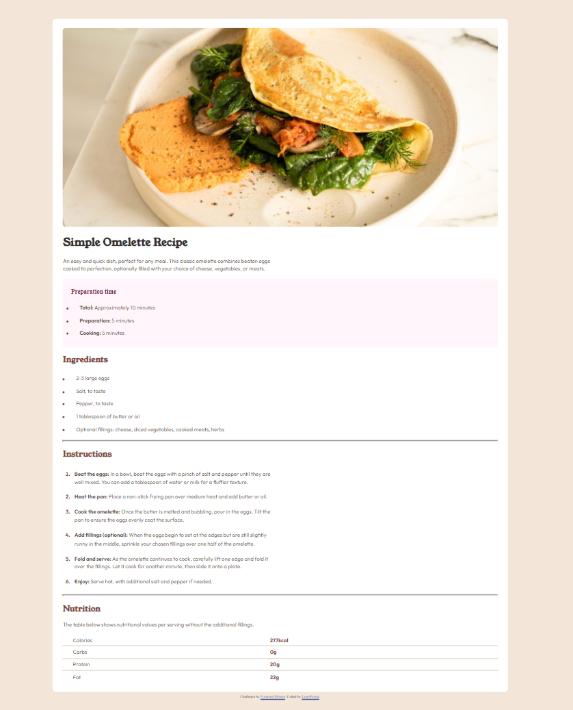

# Frontend Mentor - Recipe page solution

This is a solution to the [Recipe page challenge on Frontend Mentor](https://www.frontendmentor.io/challenges/recipe-page-KiTsR8QQKm). Frontend Mentor challenges help you improve your coding skills by building realistic projects. 

## Table of contents

- [Overview](#overview)
  - [The challenge](#the-challenge)
  - [Screenshot](#screenshot)
  - [Links](#links)
- [My process](#my-process)
  - [Built with](#built-with)
  - [What I learned](#what-i-learned)
  - [Continued development](#continued-development)
- [Author](#author)
- [Acknowledgments](#acknowledgments)


## Overview
Recipe Page Design

### Screenshot



### Links

- Solution URL: [Add solution URL here](https://your-solution-url.com)
- Live Site URL: (https://recipe-page-beta-khaki.vercel.app/)

## My process

I started by styling the body color. After that I used the div element to create a block, then i gave the block it background color. After that I imported the image and used both HTML and CSS elements to style the rest of the body. 

### Built with

- Semantic HTML5 markup
- CSS custom properties
- Flexbox
- CSS Grid

### What I learned

I learned that using image width and height function will make the whole design not to be mobile responsive.


```html
<h1>Some HTML code I'm proud of</h1>
 <div class="content">
```
```css
.proud-of-this-css {
  color: papayawhip;
}
ol > li::marker {
    font-weight: bold;
    color: hsl(14, 45%, 36%);
}
```
### Continued development
I will like to continue developing myself on how to differntiate mobile and desktop responsiveness of my designs.

## Author
- Frontend Mentor - [@MaxBidder76](https://www.frontendmentor.io/profile/MaxBidder76)

## Acknowledgments

Thanks to God almighty for the grace to finish this task.


